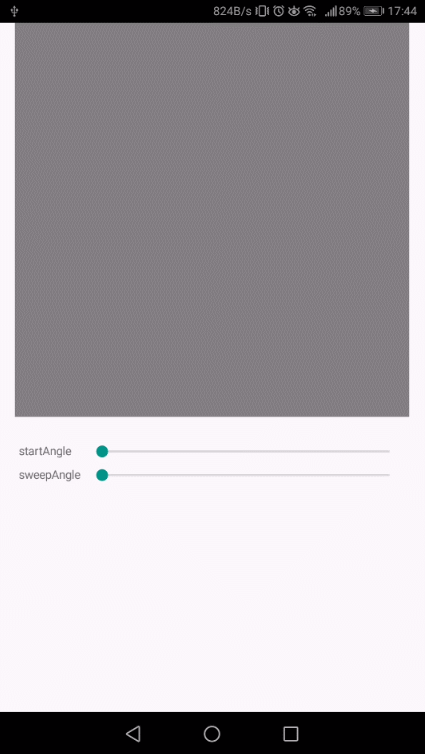

# SkiaSharpSample

以下のTeratail の質問への回答サンプルです。  
[C# Xamarin NGraphics library のデモを動かしたい。](https://teratail.com/questions/111086)  

## 概要  
SkiaSharp を使用して円グラフのような図形を描画します。  
Sliderで開始位置、描画角度を指定します。  

